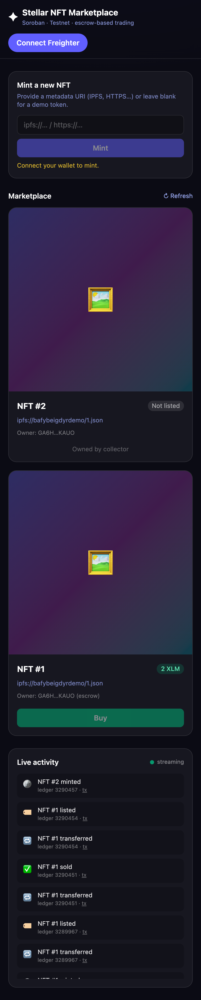
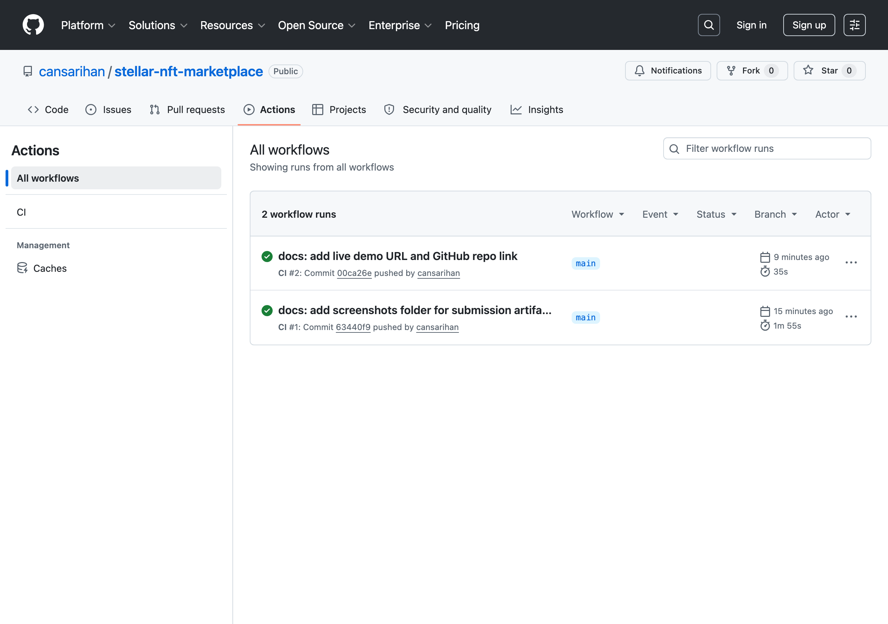
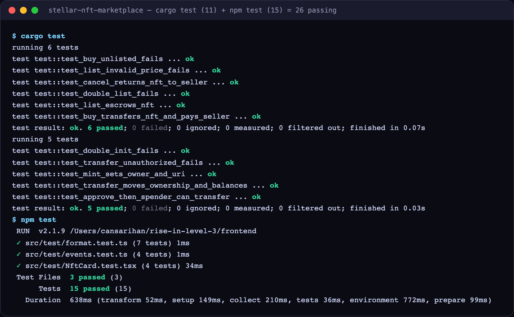
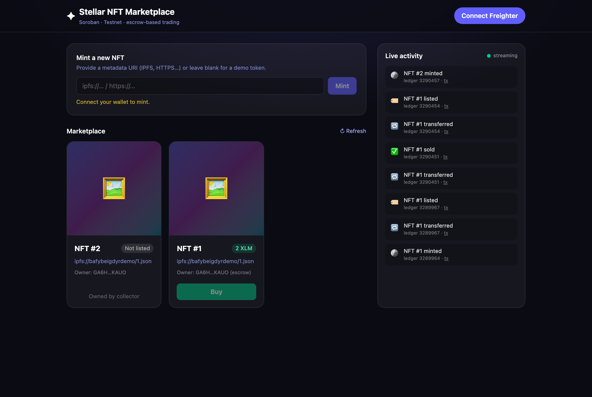

# ✦ Stellar NFT Marketplace — Soroban dApp (Level 3)

[](https://github.com/cansarihan/stellar-nft-marketplace/actions/workflows/ci.yml)

A complete, end-to-end NFT marketplace built on **Stellar / Soroban**. It
demonstrates advanced smart-contract development with **inter-contract
communication**, **on-chain event streaming**, a production-grade **CI/CD**
pipeline, a typed deployment workflow, and a **mobile-responsive** React
frontend with real-time updates, full error handling and loading states.

> Submitted for **Level 3 — Orange Belt** (Advanced Smart Contracts +
> Production-Ready dApps).

---

## 🔗 Live links & on-chain proof

| Item | Value |
| --- | --- |
| **Live demo** | **https://frontend-can-sarihan.vercel.app** |
| **GitHub repo** | https://github.com/cansarihan/stellar-nft-marketplace |
| **Demo video (~1 min)** | [docs/demo.mp4](https://github.com/cansarihan/stellar-nft-marketplace/raw/main/docs/demo.mp4) |
| **Network** | Stellar **Testnet** |
| **NFT contract** | [`CBRYT3WCYXUINJCW7TV5NRRWROGNFVCG6TA6SMSK4MUDIDJYDLZS7RKF`](https://stellar.expert/explorer/testnet/contract/CBRYT3WCYXUINJCW7TV5NRRWROGNFVCG6TA6SMSK4MUDIDJYDLZS7RKF) |
| **Marketplace contract** | [`CB5ZDO6BPMMWWA3JWOHYEDTMEEY2S37IOEGBXLBS3BJW4MXUODKG4RJ2`](https://stellar.expert/explorer/testnet/contract/CB5ZDO6BPMMWWA3JWOHYEDTMEEY2S37IOEGBXLBS3BJW4MXUODKG4RJ2) |
| **Payment token (native XLM SAC)** | `CDLZFC3SYJYDZT7K67VZ75HPJVIEUVNIXF47ZG2FB2RMQQVU2HHGCYSC` |

### Example transactions

All four transactions are confirmed `successful` on Stellar Testnet. Each row
links to the **stellar.expert** explorer and to the authoritative **Horizon**
API record (which is instant — stellar.expert's testnet indexer can lag a few
minutes behind).

| Action | Explorer | Verify (Horizon) |
| --- | --- | --- |
| NFT contract `init` | [`23dc21fe…acc93f`](https://stellar.expert/explorer/testnet/tx/23dc21fe6b9bee7aacda6809f6d265069069a281fe4aacab088d302e96acc93f) | [json](https://horizon-testnet.stellar.org/transactions/23dc21fe6b9bee7aacda6809f6d265069069a281fe4aacab088d302e96acc93f) |
| Marketplace `init` | [`4214164b…12d94f`](https://stellar.expert/explorer/testnet/tx/4214164be810d453b40d012915b608ed2136e61a78727cae94a4648c8412d94f) | [json](https://horizon-testnet.stellar.org/transactions/4214164be810d453b40d012915b608ed2136e61a78727cae94a4648c8412d94f) |
| `mint` NFT #1 | [`7113f146…646ad6`](https://stellar.expert/explorer/testnet/tx/7113f146edab88cb1a1dffca30ea7b44ac9c028a910d278715c988b8c9646ad6) | [json](https://horizon-testnet.stellar.org/transactions/7113f146edab88cb1a1dffca30ea7b44ac9c028a910d278715c988b8c9646ad6) |
| **`list` NFT #1 (inter-contract call)** | [`fd82d747…50aaa1`](https://stellar.expert/explorer/testnet/tx/fd82d747c5e50523dc0864b064f191db85763bccbe6f522c98166fcabd50aaa1) | [json](https://horizon-testnet.stellar.org/transactions/fd82d747c5e50523dc0864b064f191db85763bccbe6f522c98166fcabd50aaa1) |

> The **`list`** transaction is the headline proof of inter-contract
> communication: a single call into the marketplace emits **both** the NFT
> contract's `transfer` event (token → escrow) **and** the marketplace's
> `listed` event.

---

## 🏗️ Architecture

```
┌──────────────────────────┐         ┌──────────────────────────────┐
│   React + Vite frontend  │         │        Soroban (Rust)        │
│                          │  RPC    │                              │
│  Freighter wallet  ──────┼────────▶│   ┌────────────┐             │
│  Typed contract clients  │ invoke  │   │ marketplace │            │
│  getEvents() streaming ◀─┼─────────┤   └─────┬──────┘  escrow     │
│  Tailwind UI (responsive)│ events  │         │ cross-contract     │
└──────────────────────────┘         │         ▼ calls              │
                                      │   ┌──────────┐   ┌────────┐  │
                                      │   │   nft    │   │  XLM   │  │
                                      │   └──────────┘   │  (SAC) │  │
                                      │                  └────────┘  │
                                      └──────────────────────────────┘
```

**Two contracts, three-way interaction.** When a buyer calls
`marketplace.buy()`, the marketplace contract:

1. calls the **payment token** contract to move XLM `buyer → seller`, and
2. calls the **NFT** contract to release the escrowed token `marketplace → buyer`.

`list` escrows the NFT into the marketplace; `cancel` returns it. Every
state-changing call publishes an event consumed by the frontend in real time.

---

## ✅ Requirement checklist

| Level 3 requirement | Where |
| --- | --- |
| Advanced smart-contract development | `contracts/nft`, `contracts/marketplace` |
| Inter-contract communication | `marketplace::buy/list/cancel` → NFT + token clients |
| Event streaming & real-time updates | `frontend/src/lib/events.ts`, `EventFeed` |
| CI/CD pipeline | `.github/workflows/ci.yml` |
| Smart-contract deployment workflow | `scripts/deploy.sh` |
| Mobile-responsive frontend | Tailwind layouts (`grid`, `sm:`/`lg:` breakpoints) |
| Error handling & loading states | every action component + `Gallery` skeletons |
| Tests (contracts + frontend) | `contracts/**/src/test.rs`, `frontend/src/test` |
| Production-ready architecture | typed bindings, env config, separation of concerns |
| Documentation & demo | this README + demo video |

---

## 🧱 Tech stack

- **Contracts:** Rust, `soroban-sdk` 25, Stellar CLI 26 (`wasm32v1-none`)
- **Frontend:** React 19, TypeScript, Vite 6, Tailwind CSS v4
- **Chain access:** `@stellar/stellar-sdk` (RPC + typed contract bindings),
  `@stellar/freighter-api` (wallet)
- **Testing:** `cargo test` (11 tests), Vitest + Testing Library (15 tests)
- **CI/CD:** GitHub Actions · **Hosting:** Vercel

---

## 🚀 Getting started

### Prerequisites
- Rust + `rustup target add wasm32v1-none`
- [Stellar CLI](https://developers.stellar.org/docs/tools/cli) ≥ 22
- Node.js ≥ 18 and the [Freighter](https://www.freighter.app/) browser extension

### 1. Contracts — build & test
```bash
cargo test                 # run all 11 contract tests
stellar contract build     # produce optimized .wasm artifacts
```

### 2. Deploy to testnet
```bash
stellar keys generate deployer --network testnet --fund
./scripts/deploy.sh testnet deployer
```
The script prints the contract IDs to drop into `frontend/.env.local`.

### 3. Frontend — run locally
```bash
cd frontend
cp .env.example .env.local   # defaults already point at the live deployment
npm install
npm run dev                  # http://localhost:5173
npm test                     # 15 passing tests
npm run build                # production build
```

---

## 🧪 Testing

```text
contracts:  cargo test  → 11 passed   (nft: 5, marketplace: 6)
frontend:   npm test    → 15 passed   (format, events, NftCard)
```

Contract tests cover minting, ownership, approvals, the full
list → buy → cancel escrow lifecycle, and every error path. Frontend tests
cover price math, event formatting, and component rendering states.

---

## ⚙️ CI/CD

`.github/workflows/ci.yml` runs on every push and PR:

- **CI — contracts** job — `cargo test` + release Wasm build on `wasm32v1-none`
- **CI — frontend** job — `npm ci`, type-check, Vitest, production build
- **CD — deploy** job — on every push to `main`, after both CI jobs pass, the
  frontend is built and **automatically deployed to GitHub Pages**
  → https://cansarihan.github.io/stellar-nft-marketplace/

All jobs cache dependencies and fail the pipeline on any error; deployment only
runs when the full test suite is green.

---

## 🗂️ Project structure

```
.
├── contracts/
│   ├── nft/             # ERC-721-style NFT contract (mint/transfer/approve)
│   └── marketplace/     # escrow listing/buy/cancel + cross-contract calls
├── frontend/
│   └── src/
│       ├── contracts/   # generated typed bindings (nft, marketplace)
│       ├── lib/         # wallet, clients, actions, events, formatting
│       ├── hooks/       # useWallet, useEvents
│       ├── components/  # Header, MintForm, Gallery, NftCard, EventFeed
│       └── test/        # Vitest unit + component tests
├── scripts/deploy.sh    # reproducible deployment workflow
└── .github/workflows/   # CI/CD
```

---

## 📸 Screenshots

### Mobile responsive UI


### CI/CD pipeline (passing)


### Test output — 26 passing (11 contract + 15 frontend)


### Desktop


### Demo video (~1 min)
A one-minute walkthrough that fires **real on-chain transactions** mid-recording
and shows the live event feed streaming them in real time (mint → the new NFT
appears with no refresh → list → the inter-contract escrow `transfer` + `listed`
events arrive live).

▶️ **[Watch docs/demo.mp4](https://github.com/cansarihan/stellar-nft-marketplace/raw/main/docs/demo.mp4)**

---

## 📄 License

MIT — built for the Stellar Level 3 builder program.
